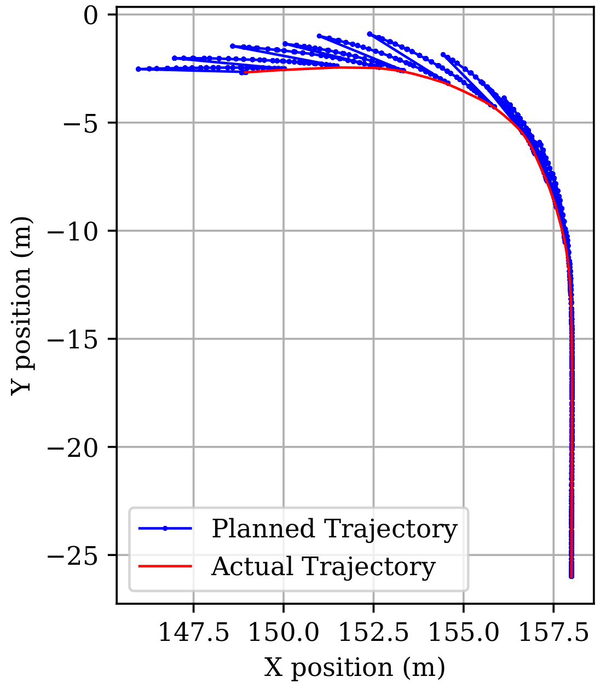

# Oracle-based Assessment

## Files

 - **assessed_scenarios.zip** : This is the data to be processed: the planned and actual trajectories of all 30 basic scenarios.

 - **B2_03_Town01_SharpLeft_Failed.txt** : One sample data from the above zip file.

 - **m1_\*.py**  to **m4_\*.py** : Python script to evaluate the control performance of 4 metrics.

 - **plot_diff.py** : Plot the diff between planned and actual trajectory.


## Usage

Before analysis, make sure pandas, matplotlib and numpy are installed in python.

Unzip the scenario data:

```shell
unzip assessed_scenarios.zip
```

To evaluate the Tracking Error, Responsiveness, Stability or Smoothness of the collected scenarios, run the corresponding python script with the folder name. For example, I want to anlayze the Tracking Error:


```shell
python3 ./m1_TE.py ./assessed_scenarios/
```

Then the analysis result for each file will be shown:

```
Analyzed file:  B5_01_Town10_UnsharpRight_Failed.txt
Analysis Results:
{'distance': {'max_error': 2.730880451190229, 'mean_error': 1.0223235124508911}, 'theta': {'max_error': 2.765438093978439, 'mean_error': 0.546907123719785, 'max_error_percentage': 3.565946407021498, 'mean_error_percentage': 0.7052197252397561}, 'v': {'max_error': 3.183103, 'mean_error': 0.7863355838041431, 'max_error_percentage': 175.498561210381, 'mean_error_percentage': 43.354162144973664}, 'a': {'max_error': 2.184832, 'mean_error': 1.0957203217648643, 'max_error_percentage': -3073.711814838403, 'mean_error_percentage': -1541.5045636310708}}

Mean Values:
{'theta': 77.55130835766839, 'v': 1.8137487726661286, 'a': -0.07108122464352974}

```

Additionally, **plot_diff.py** can plot the diff of trajectories for a certain data sample. For example:


```shell
python3 ./plot_diff.py ./B2_03_Town01_SharpLeft_Failed.txt
```


Then the diff between two trajectories will show:





